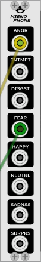

# VCV Plugin for Mienophone

Once the todos below have been implemented, the Mienophone VCV plugin will:
 * capture pictures from a webcam
 * trade the pictures for emotion parameters using [MS Face API](https://westus.dev.cognitive.microsoft.com/docs/services/563879b61984550e40cbbe8d/operations/563879b61984550f30395236) (internet connection required)
 * map emotion parameters onto module outputs.

## What?



## What for?

https://mienophone.com/

## Todo

- [ ] API requests must be non-blocking (Multithreading / Async / curl "hiper")
- [ ] webcam capture (we could run this separately, e.g. `fswebcam -q -r 1280x720 --crop 480x720,500x0 capture.jpg`)
- [ ] add clock/gate input
- [ ] fix memory leaks
- [ ] cleanup the ugliness from shameless green code.
- [ ] cross-plattform (mac/bsd)
- [ ] test if this benefits from video streams instead of posting images 

## Build and Installation

### Dependencies

* build-essential
* curl API
* v4l - see [example code](https://gist.github.com/mike168m/6dd4eb42b2ec906e064d) but this is not cross-plattform compatible
* [VCV Rack SDK](https://github.com/stellare-modular/vcv-rack-sdk)

```
apt install libcurl4-openssl-dev build-essential
git clone https://github.com/stellare-modular/vcv-rack-sdk.git
echo "export RACK_DIR=<Rack SDK folder>" >> ~/.bashrc
```

See also [VCV Rack PluginDevelopmentTutorial](https://vcvrack.com/manual/PluginDevelopmentTutorial)

### Build Plugin

export RACK_DIR=$HOME/Projects/vcvrack/Rack-SDK

```
make
make dist
make install
```

## Test

### Fake API

```
docker build . -t fake-api
docker run -it --rm -d --name fake-api -p 8080:8080 fake-api
curl -i http://localhost:8080/face/v1.0/detect
```
